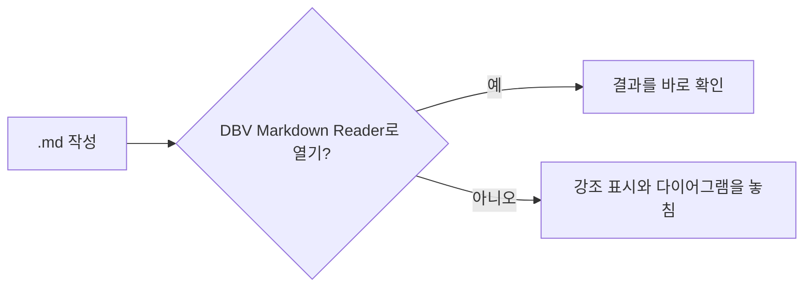
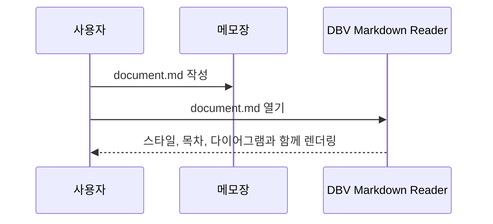

# 📘 Markdown 및 GitHub Flavored Markdown 참고 가이드

> 메모장, Notepad++, VS Code 등 어떤 일반 텍스트 편집기에서든 `.md` 문서를 작성하고, **DBV Markdown Reader**에서 완벽하게 확인하기 위한 종합 치트시트입니다.
>
> 복사해서 붙여넣고, 수정한 뒤 `.md`로 저장하세요. 아래에 보이는 모든 내용은 렌더링 결과이기도 합니다 — 이 파일을 DBV Markdown Reader로 열어 바로 확인해 보세요.

---

## 📑 목차

- [1. 제목](#1-제목)
- [2. 강조 (굵게, 기울임, 취소선)](#2-강조-굵게-기울임-취소선)
- [3. 문단과 줄바꿈](#3-문단과-줄바꿈)
- [4. 목록](#4-목록)
- [5. 작업 목록 (GFM)](#5-작업-목록-gfm)
- [6. 링크](#6-링크)
- [7. 이미지](#7-이미지)
- [8. 인용문](#8-인용문)
- [9. 인라인 코드와 코드 블록](#9-인라인-코드와-코드-블록)
- [10. 언어별 구문 강조](#10-언어별-구문-강조)
- [11. 표 (GFM)](#11-표-gfm)
- [12. 가로줄](#12-가로줄)
- [13. 자동 링크](#13-자동-링크)
- [14. 각주](#14-각주)
- [15. HTML 삽입](#15-html-삽입)
- [16. 이스케이프 문자](#16-이스케이프-문자)
- [17. 이모지](#17-이모지)
- [18. 수식 (KaTeX)](#18-수식-katex)
- [19. Mermaid 다이어그램](#19-mermaid-다이어그램)
- [20. GitHub 스타일 알림 / 콜아웃](#20-github-스타일-알림--콜아웃)
- [21. 멘션과 이슈 참조 (텍스트 전용)](#21-멘션과-이슈-참조-텍스트-전용)
- [22. 모범 사례와 팁](#22-모범-사례와-팁)
- [23. 앱 키보드 단축키](#23-앱-키보드-단축키)

---

## 1. 제목

`#`(가장 중요)부터 `######`(가장 덜 중요)까지 6단계가 있습니다. `#` 뒤에는 항상 공백을 넣으세요.

```markdown
# 제목 1단계
## 제목 2단계
### 제목 3단계
#### 제목 4단계
##### 제목 5단계
###### 제목 6단계
```

# 제목 1단계
## 제목 2단계
### 제목 3단계
#### 제목 4단계
##### 제목 5단계
###### 제목 6단계

> 💡 DBV Markdown Reader는 이 제목들로 탐색 가능한 **목차(TOC)**를 자동으로 만들어 줍니다 — 직접 만들 필요가 없습니다.

"Setext" 방식(H1과 H2만 가능):

```markdown
H1 제목
=============

H2 제목
-------------
```

---

## 2. 강조 (굵게, 기울임, 취소선)

```markdown
*기울임* 또는 _기울임_
**굵게** 또는 __굵게__
***굵게 + 기울임*** 또는 **_조합_**
~~취소선~~ (GFM 확장)
```

*기울임* — **굵게** — ***굵게 + 기울임*** — ~~취소선~~

---

## 3. 문단과 줄바꿈

문단은 연속된 하나 이상의 텍스트 줄이며, 다른 문단과는 **빈 줄 하나**로 구분합니다.

같은 문단 안에서 강제로 줄을 바꾸려면(`<br>`) 줄 끝에 **공백 두 개 이상**을 넣거나 줄 끝에 `\`를 사용하세요:

```markdown
끝에 공백 두 개가 있는 첫 줄··
같은 문단의 두 번째 줄.

끝에 백슬래시가 있는 첫 줄\
같은 문단의 두 번째 줄.
```

---

## 4. 목록

### 순서 없는 목록

`-`, `*`, `+`를 서로 바꿔 쓸 수 있습니다(같은 단계에서 섞어 쓰지는 마세요):

```markdown
- 첫 번째 항목
- 두 번째 항목
  - 하위 항목 (공백 2칸 들여쓰기)
    - 하위의 하위 항목
- 세 번째 항목
```

- 첫 번째 항목
- 두 번째 항목
  - 하위 항목
    - 하위의 하위 항목
- 세 번째 항목

### 순서 있는 목록

```markdown
1. 첫 번째 단계
2. 두 번째 단계
   1. 하위 단계
   2. 또 다른 하위 단계
3. 세 번째 단계
```

1. 첫 번째 단계
2. 두 번째 단계
   1. 하위 단계
   2. 또 다른 하위 단계
3. 세 번째 단계

> 💡 시작 번호는 그대로 적용되고, 나머지는 모든 줄에 `1.`이라고 써도 자동으로 다시 번호가 매겨집니다.

---

## 5. 작업 목록 (GFM)

체크박스 목록입니다(GFM 확장, `markdown-it-task-lists`로 지원):

```markdown
- [x] 완료한 작업
- [ ] 남은 작업
- [ ] 또 다른 남은 작업
  - [x] 완료한 하위 작업
```

- [x] 완료한 작업
- [ ] 남은 작업
- [ ] 또 다른 남은 작업
  - [x] 완료한 하위 작업

---

## 6. 링크

```markdown
[링크 텍스트](https://example.com)
[제목이 있는 링크](https://example.com "마우스를 올리면 이 글이 나타납니다")
[참조 방식 링크][ref]
[다른 파일로 가는 상대 경로 링크](./another-document.md)
[이 문서 안의 제목으로 가는 링크](#6-링크)

[ref]: https://example.com "참조 정의"
```

[링크 텍스트](https://example.com) · [제목이 있는 링크](https://example.com "마우스를 올리면 이 글이 나타납니다") · [참조 방식 링크][ref] · [다른 파일로 가는 상대 경로 링크](./README.md) · [이 문서 안의 제목으로 가는 링크](#6-링크)

[ref]: https://example.com "참조 정의"

---

## 7. 이미지

링크와 같되 앞에 `!`를 붙입니다:

```markdown


[](https://github.com/davidbuenov/dbv-md-reader)
```


[](https://github.com/davidbuenov/dbv-md-reader)

> 💡 상대 경로는 리더에서 연 `.md` 파일 자체의 위치를 기준으로 해석됩니다.

---

## 8. 인용문

```markdown
> 간단한 인용문입니다.

> 여러 문단으로 된 인용문.
>
> 같은 인용문의 두 번째 문단.

> 1단계
>> 2단계 (중첩 인용문)
>>> 3단계
```

> 간단한 인용문입니다.

> 여러 문단으로 된 인용문.
>
> 같은 인용문의 두 번째 문단.

> 1단계
>> 2단계 (중첩 인용문)
>>> 3단계

---

## 9. 인라인 코드와 코드 블록

백틱 하나로 인라인 코드: `` `인라인 코드` `` → `인라인 코드`

**백틱 세 개**와 언어 이름으로 구문 강조가 적용된 코드 블록을 만듭니다:

````markdown
```python
def greet(name: str) -> str:
    return f"Hello, {name}!"
```
````

```python
def greet(name: str) -> str:
    return f"Hello, {name}!"
```

공백 4칸으로 들여써서 "고전적인" 코드 블록을 만들 수도 있습니다(언어별 강조 없음):

```markdown
    이것은 코드 블록입니다
    공백 4칸으로 들여썼습니다
```

렌더링 결과:

    이것은 코드 블록입니다
    공백 4칸으로 들여썼습니다

---

## 10. 언어별 구문 강조

DBV Markdown Reader는 언어 식별자에 따라 코드 블록에 자동으로 색을 입힙니다. 현재 지원하는 언어:

`bash` · `c` · `cpp` · `csharp` · `diff` · `docker` · `go` · `ini` · `java` · `json` · `jsx` · `markdown` · `powershell` · `python` · `rust` · `sql` · `toml`

```bash
#!/bin/bash
echo "Hello from Bash"
```

```json
{
  "name": "dbv-md-reader",
  "version": "1.0.0"
}
```

```rust
fn main() {
    println!("Hello from Rust");
}
```

> 💡 모든 코드 블록에는 **줄 번호**와 내용을 복사하는 버튼도 함께 표시됩니다.

---

## 11. 표 (GFM)

일반 텍스트에서 열을 눈으로 맞출 필요는 없지만, 맞춰 두면 읽기 편합니다. 정렬은 구분선 줄의 `:`로 지정합니다:

```markdown
| 왼쪽 열            | 가운데 열          | 오른쪽 열           |
| :------------------ | :-----------------: | --------------------: |
| 텍스트              | 텍스트              | 텍스트              |
| 더 긴 텍스트 예시   | 짧음                | 123                 |
```

| 왼쪽 열            | 가운데 열          | 오른쪽 열           |
| :------------------ | :-----------------: | --------------------: |
| 텍스트              | 텍스트              | 텍스트              |
| 더 긴 텍스트 예시   | 짧음                | 123                 |

---

## 12. 가로줄

한 줄에 하이픈, 별표, 밑줄을 세 개 이상 씁니다:

```markdown
---
***
___
```

---

## 13. 자동 링크

```markdown
<https://example.com>
<mail@example.com>

https://example.com (그냥 쓴 URL도 GFM이 < > 없이 자동으로 인식합니다)
```

<https://example.com> — <mail@example.com>

---

## 14. 각주

`markdown-it-footnote`로 지원되는 GFM 확장입니다:

```markdown
근거가 필요한 문장입니다[^1].

이름이 있는 또 다른 각주입니다[^long-note].

[^1]: 첫 번째 각주입니다.
[^long-note]: 각주에도 **Markdown 서식**을 모두 쓸 수 있고,
    들여쓰기만 맞으면 여러 줄도 가능합니다.
```

근거가 필요한 문장입니다[^1].

이름이 있는 또 다른 각주입니다[^long-note].

[^1]: 첫 번째 각주입니다.
[^long-note]: 각주에도 **Markdown 서식**을 모두 쓸 수 있고, 들여쓰기만 맞으면 여러 줄도 가능합니다.

---

## 15. HTML 삽입

Markdown 문법으로 표현할 수 없는 경우를 위해 "원시" HTML을 허용합니다. DBV Markdown Reader는 표시하기 전에 **DOMPurify**로 정화합니다(보안을 위해 `<script>` 태그와 위험한 속성은 제거됩니다):

```markdown
<div align="center">
  <b>가운데 정렬된 굵은 글씨</b>
</div>

<details>
<summary>클릭하여 펼치기</summary>

클릭하면 펼쳐지는 숨겨진 내용입니다.

</details>
```

<details>
<summary>클릭하여 펼치기</summary>

클릭하면 펼쳐지는 숨겨진 내용입니다. FAQ를 만들거나 긴 로그/코드 블록을 숨길 때 아주 유용합니다.

</details>

---

## 16. 이스케이프 문자

Markdown에서 특별한 의미가 있는 문자를 그대로 표시하려면 앞에 `\`를 붙입니다:

```markdown
\* 이것은 목록이 아닙니다 \*
\# 이것은 제목이 아닙니다
\[이것은 링크가 아닙니다\]
```

\* 이것은 목록이 아닙니다 \* — \# 이것은 제목이 아닙니다 — \[이것은 링크가 아닙니다\]

이스케이프할 수 있는 문자: `` \ ` * _ { } [ ] ( ) # + - . ! | ``

---

## 17. 이모지

유니코드 이모지(✅ 🚀 📌 ⚠️)를 그대로 붙여넣거나, 원본 편집기(예: GitHub)가 내보낼 때 지원한다면 `:이름:` 단축 표기를 쓸 수 있습니다 — DBV Markdown Reader는 텍스트에 이미 들어 있는 유니코드 이모지를 표시합니다.

```markdown
✅ 완료 — 🚧 진행 중 — ❌ 막힘 — ⚠️ 주의 — 💡 아이디어
```

✅ 완료 — 🚧 진행 중 — ❌ 막힘 — ⚠️ 주의 — 💡 아이디어

---

## 18. 수식 (KaTeX)

**KaTeX**로 수식을 표기합니다. 문장 안 수식은 `$...$`, 가운데 정렬 블록 수식은 `$$...$$`를 씁니다.

```markdown
정지 에너지 공식은 아인슈타인이 정립한 $E = mc^2$ 입니다.

$$
\int_{a}^{b} f(x)\,dx = F(b) - F(a)
$$

$$
\frac{-b \pm \sqrt{b^2 - 4ac}}{2a}
$$
```

정지 에너지 공식은 아인슈타인이 정립한 $E = mc^2$ 입니다.

$$
\int_{a}^{b} f(x)\,dx = F(b) - F(a)
$$

$$
\frac{-b \pm \sqrt{b^2 - 4ac}}{2a}
$$

---

## 19. Mermaid 다이어그램

` ```mermaid ` 블록은 인터랙티브한 벡터 다이어그램으로 렌더링됩니다:

````markdown

````


시퀀스, 클래스, 상태, 간트, 파이, gitGraph 다이어그램 등 표준 Mermaid 문법을 모두 지원합니다:



---

## 20. GitHub 스타일 알림 / 콜아웃

GitHub Flavored Markdown은 메시지에 주목을 끌기 위한 특별한 인용 블록을 정의합니다. 일반 인용(`>`)에 첫 줄의 라벨을 붙여 씁니다:

```markdown
> [!NOTE]
> 훑어보는 독자도 알아야 할 유용한 정보.

> [!TIP]
> 무언가를 더 잘, 더 빠르게 하도록 돕는 선택적 조언.

> [!IMPORTANT]
> 사용자가 목표를 달성하는 데 꼭 필요한 정보.

> [!WARNING]
> 문제를 피하려면 즉시 주의해야 하는 긴급한 내용.

> [!CAUTION]
> 어떤 행동의 부정적인 결과 가능성.
```

> [!NOTE]
> 훑어보는 독자도 알아야 할 유용한 정보.

> [!TIP]
> 무언가를 더 잘, 더 빠르게 하도록 돕는 선택적 조언.

> [!IMPORTANT]
> 사용자가 목표를 달성하는 데 꼭 필요한 정보.

> [!WARNING]
> 문제를 피하려면 즉시 주의해야 하는 긴급한 내용.

> [!CAUTION]
> 어떤 행동의 부정적인 결과 가능성.

---

## 21. 멘션과 이슈 참조 (텍스트 전용)

이 문법은 GitHub 인터페이스의 기능입니다(문서가 GitHub 저장소 **안에** 있을 때 링크가 됩니다). DBV Markdown Reader 같은 로컬 리더에는 연결할 저장소 정보가 없으므로 **일반 텍스트**로 표시됩니다:

```markdown
@username          → 사용자 멘션 (GitHub에서만 동작)
#123               → 이슈/PR #123 참조 (GitHub에서만 동작)
owner/repo#123     → 다른 저장소 참조 (GitHub에서만 동작)
```

---

## 22. 모범 사례와 팁

- 긴 문단에서는 **한 줄에 한 가지 생각**만 쓰면 버전 관리가 쉬워집니다(`git diff`가 줄 단위로 보입니다).
- 제목, 목록, 표, 코드 블록의 앞뒤에는 **빈 줄 하나**를 두세요 — 여러 Markdown 엔진 사이의 호환성이 좋아집니다.
- 한 목록의 모든 항목에는 항상 **같은 문자**(`-`, `*`, `+` 중 하나)를 쓰세요.
- 이미지와 프로젝트 내부 링크에는 **상대** 경로를 쓰세요. 폴더 전체를 옮겨도 문서가 계속 동작합니다.
- 큰 표는 "Markdown Table Generator" 같은 온라인 도구로 열을 맞추면 편합니다 — 다만 `.md`의 시각적 간격은 순전히 보기용이며 렌더링에는 영향이 없습니다.
- 한글, 악센트 문자, 이모지 문제를 피하려면 항상 **UTF-8**(BOM 없음)로 저장하세요.
- 코드 블록 안에 백틱 자체(` ``` `)를 보여 주려면, 바깥 블록을 안쪽보다 더 많은 백틱으로 감싸세요(예: 3개가 든 블록은 4개로 감쌉니다).

---

## 23. 앱 키보드 단축키

여기부터는 Markdown 문법이 아니라 **DBV Markdown Reader** 자체의 키보드 단축키입니다 — Windows/Linux에서는 `Ctrl`, macOS에서는 `Cmd`로 동일합니다.

| 단축키 | 동작 |
| --- | --- |
| `Ctrl/Cmd + O` | 파일 열기 |
| `Ctrl/Cmd + F` | 문서 내 검색 |
| `Ctrl/Cmd + K` | 빠른 열기 — 이름으로 파일로 이동 |
| `Ctrl/Cmd + E` | 편집 모드 전환 |
| `Ctrl/Cmd + S` | 저장 (편집 모드) |
| `Ctrl/Cmd + B` | 굵게 (편집기에 커서가 있을 때) |
| `Ctrl/Cmd + I` | 기울임 (편집기에 커서가 있을 때) |
| `Tab` / `Shift + Tab` | 줄 또는 선택 영역 들여쓰기 / 내어쓰기 (편집기) |
| `Ctrl/Cmd + P` | 인쇄 / PDF로 내보내기 |
| `Ctrl/Cmd + +` / `Ctrl/Cmd + -` | 확대 / 축소 |
| `Ctrl/Cmd + 0` | 확대/축소 초기화 |
| `Alt + ←` / `Alt + →` | 탐색 기록에서 뒤로 / 앞으로 |
| `Home` / `End` | 문서의 처음 / 끝으로 이동 (입력란 밖에서) |
| `Esc` | 열려 있는 패널이나 모달 닫기 |
| `↑` `↓` `Enter` | 결과 탐색 및 열기 (빠른 열기 또는 검색이 열려 있을 때) |

**마우스:**

- 편집기에서 단어를 더블클릭하면 그 단어가 선택됩니다 — `Ctrl/Cmd + B` / `Ctrl/Cmd + I`로 바로 굵게/기울임을 적용할 수 있습니다.
- Mermaid 다이어그램에서 오른쪽 클릭 → "mermaid.live에서 열기".
- 트리의 파일이나 폴더에서 오른쪽 클릭 → "새 창에서 열기" / "파일 탐색기에서 보기".

---

<div align="center">

📄 **[DBV Markdown Reader](https://github.com/davidbuenov/dbv-md-reader)** 사용자를 위해 만든 참고 문서입니다 — 앱으로 직접 열어 렌더링 결과를 확인해 보세요.

</div>
